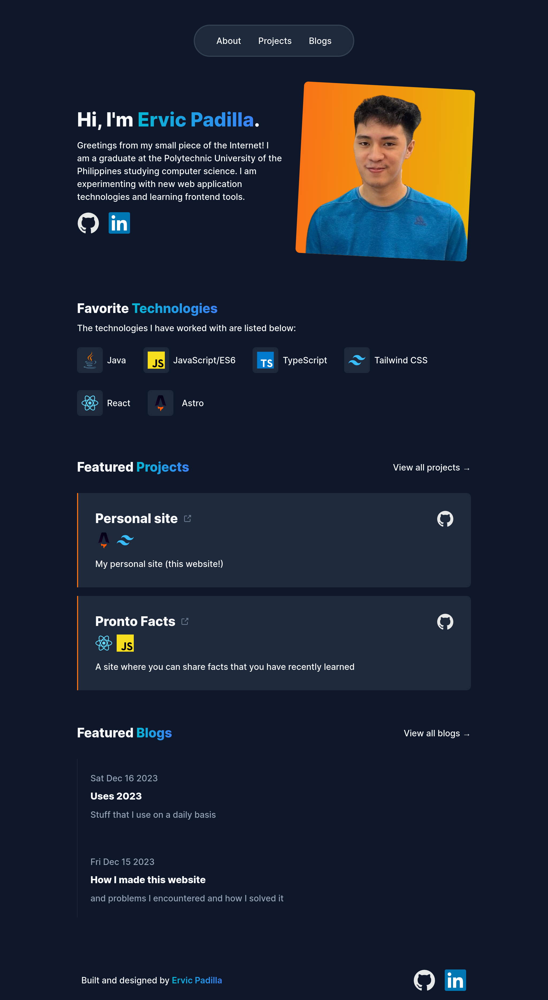

# valid-replica.github.io/

A simple responsive personal website built with [Astro](https://astro.build/) and [Tailwind CSS](https://tailwindcss.com/)

## Getting started

All commands are run from the root of the project, from a terminal:

| Command       | Action                                      |
| :------------ | :------------------------------------------ |
| `npm install` | Installs dependencies                       |
| `npm run dev` | Starts local dev server at `localhost:4321` |
