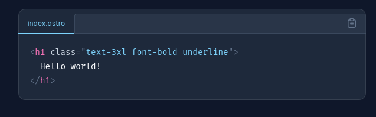
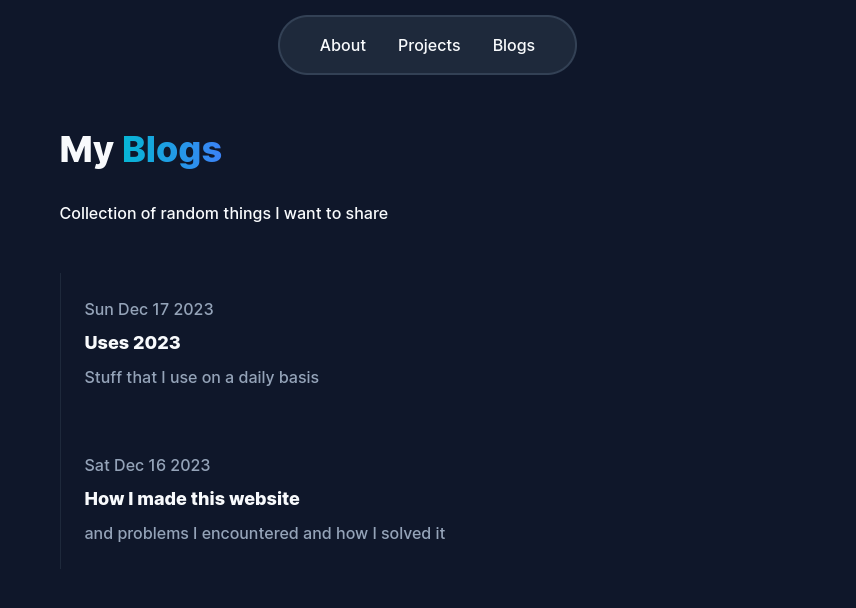
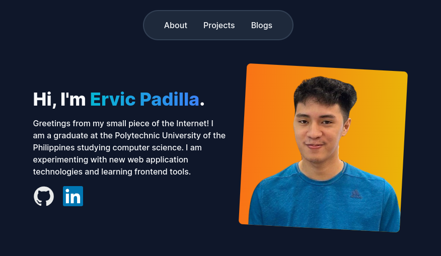

# Hi there!

I've always wanted to make a website for myself. At first, I was thinking of doing this website with just plain HTML, CSS and JavaScript. But I was intrigued with Astro since I saw on their site that Astro would be great for [portfolios](https://astro.build/themes/?categories%5B%5D=portfolio).

I can do this in two ways: By just using a theme template and just changing stuff, or starting from scratch. But since I'm learning, I might as well just start from scratch and apply my learnings.

I started with creating my repo and installing Astro where I was greeted by Houston. After the installation, I read about the documentation of Astro and how a project is structured. At first I started doing my homepage at `index.astro` the default one, which I later learned that Layouts exists, I then made a base layout on where i can reuse with my other pages.

After making my homepage I was excited on using Tailwind because having this black and white page and giving it style and colors satisfies something in me. Tailwind has been on my sights since I like having a uniform style without thinking too much and without having to scroll back and forth when applying styles on my classes.

Upon seeing my skills only on plain text, I thought it might be better if I use some images, I read about on how SVGs are better for this case and I got my icons on this [site](https://iconify.design/) pretty easily.

Now I need to add the other two pages: my projects and my blogs. I then read about Content Collections, I watched some tutorials and other's code on how to implement this. They basically use entries (markdown) placed on a directory. Now from the documentation, it said I need to define these collections by using `config.ts`. The markdowns will then have this things at the top where we reference the `config.ts` collection schema.

To display these posts, still in the documentation, it said to query the collections I should use `getColletion()` and `getEntry()` in order to access these collection. Now I can just reference it in the HTML elements like so `<h2>{post.data.title}</h2>` to display it in the page. Astro uses `slugs` in order to route my cards to the markdown files.

I just want to display my featured projects and blogs to my home. I added "featured" boolean in the schema in `config.ts` so that I can just loop through the collection and if the collection has a "featured" ticked on true it will display on the homepage.

My site needed some animations. Astro has this built-in and it's called View Transitions. To use it, I just inserted two lines of code. `import { ViewTransitions } from 'astro:transitions';` and adding `<ViewTransitions />` in the HTML head.

Lastly, all that's left is to deploy my site using GitHub Pages, luckily the Astro documentation provides instruction on how to do so. It recommended using GitHub Actions and adding some configs in order to deploy my site.

Now my website is finished and I have learned a lot! I will probably do this again in the future when I feel like it needs updating.
