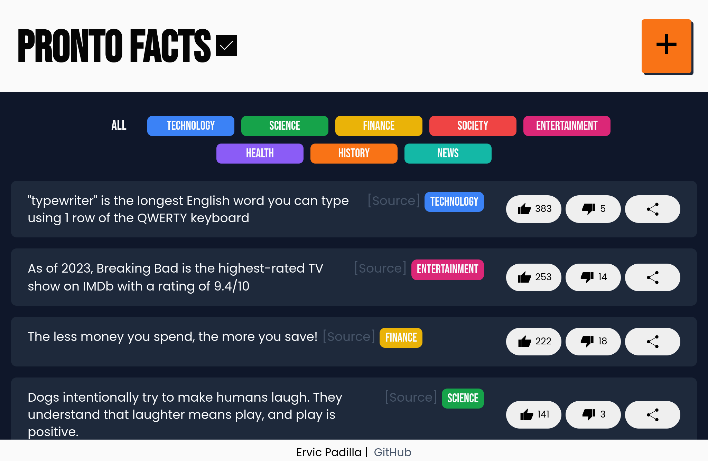

A web app where you can share facts. The front-end was made using React uses Supabase for the database of user's inputs. The facts are also categorized in their own respective topics. You can also curate the list of facts on whether some facts are true or not.

## Technologies used:

- React
- JavaScript/ES6
- CSS
- Supabase

[Live link](https://prontofacts.netlify.app/)
